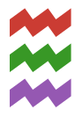
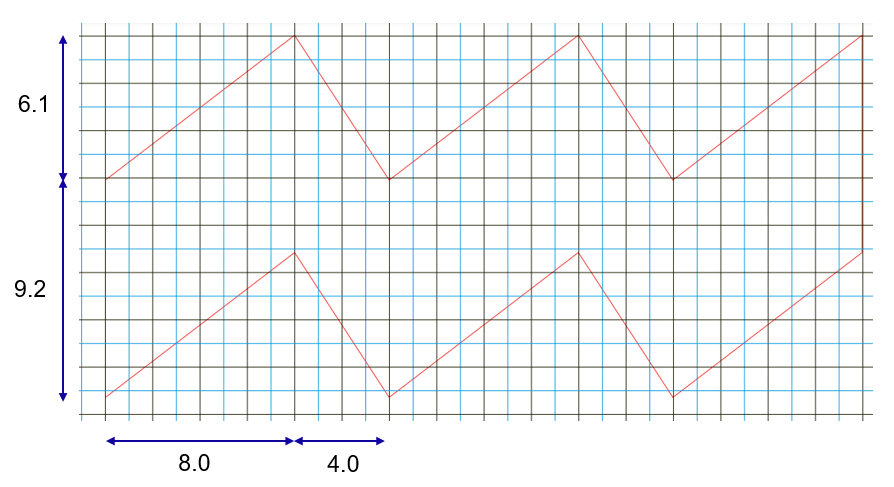

# EindhovenLogo

[](https://github.com/invenia/BlueStyle)

The code to generate logos for the JuliaLang Eindhoven meetup organization.

Inspired by [julia-logo-graphics](https://github.com/JuliaLang/julia-logo-graphics). Based on [Luxor.jl](https://github.com/JuliaGraphics/Luxor.jl). The Julia logo is shared under the Creative Commons "BY-NC-SA" 4.0 License, so we follow that license here.

The [Eindhoven vibes](https://www.eindhoven.nl/bestuur-en-beleid/organisatie/logo-en-huisstijl-stad-eindhoven) are property of the Eindhoven municipality, but we are allowed to use it in any form except the official red style. Please never generate the vibes in the red style!

## Example usage

```julia
using EindhovenLogo
save_vibes("images/vibes_small.png"; scale=1)
```



## Notes

Non-mac users may need to download the [Banga MN font](https://fontmeme.com/fonts/bangla-mn-regular-font/) which is the Julia logo font.

## Technical details

I am still looking for the official specs of the Eindhoven vibes, please email me if you know them. I measured the dimensions myself. They match visually when I overlay my vibes on top of the official vibes.

